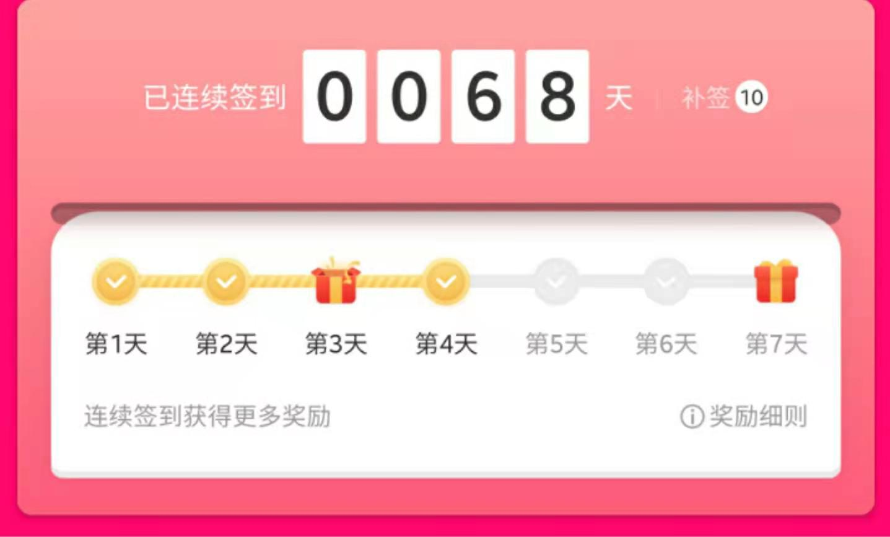

什么值得买每日签到脚本
===

<p align="center">
    
    
    
    
</p>

# 1. 实现功能
+ `什么值得买`每日签到
+ 通过 `SERVERCHAN`推送简单的运行结果到微信
+ 由 `github actions` 每日7点定时运行

# 2. 使用方法
1. Fork [此仓库项目](https://github.com/stark666/smzdm_bot) > 点击右上角fork按钮即可，欢迎点`star`~
2. Secret新增`SMZDM_COOKIE`，填入浏览器调试模式从[什么值得买官网](https://www.smzdm.com/)cookie信息, 不懂可看下面的其它
3. （可选）Secret新增`SERVERCHAN_SECRETKEY`，获取方法可看这篇文章[@ruicky教程](https://ruicky.me/2020/06/05/jd-sign/)
4. fork后必须修改一下文件，才能执行定时任务, 可修改 `README.MD`, 添加一个空格


# 3. 其它
## 3.1 cookie获取方法
+ 首先使用chrome浏览器，访问[什么值得买官网](https://www.smzdm.com/)， 登陆账号
+ Windows系统可按 `F12` 快捷键打开开发者工具, Mac 快捷键 `option + command + i`
+ 选择开发者工具Network，刷新页面 ,选择第一个`www.smzdm.com`, 找到`Requests Headers`里的`Cookie`。

## 3.2 更改执行时间
在 `.github/main.yml`中，找到
```yml
- cron: '0 0 * * *'
```
语法同crontab，具体可百度，为美区时间，加8小时为中国时间


# N. Log
在没有更换`SMZDM_COOKIE`的情况下，截至2020-12-12, 我的账号已正常签到68天，具体`SMZDM_COOKIE`有效时间继续验证。  
<br/>

+ 2020-10-08  
first push

+ 2020-12-12  
修复如果没有填写`SERVERCHAN_SECRETKEY`，会在正常签到后报错的问题。  
现在没有`SERVERCHAN_SECRETKEY`也可以正常签到并不报错。
